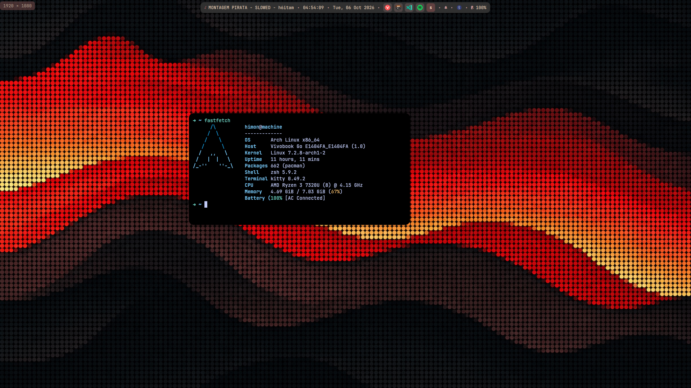

# dotfiles

Arch Linux + Hyprland (Lua) with a Quickshell island bar.

| folder | what |
|---|---|
| `hypr/` | monitors, appearance, input, keybinds, autostart, window rules |
| `quickshell/` | bar, OSD, notifications, launcher, power menu, lock screen, wallpaper, screenshot, bluetooth, polkit agent |
| `kitty/` | terminal |

## Install

```sh
git clone <repo-url> ~/.dotfiles
~/.dotfiles/install.sh
```

`install.sh` symlinks every folder in the repo into `~/.config`, backing up
anything already there to `<name>.bak.<timestamp>`. It is safe to re-run.

- `-n`, `--dry-run` — show what it would do
- `--unlink` — remove the links this repo created

## IPC

```sh
qs ipc call <target> <function>
```

Targets: `notifcenter`, `notifviewer`, `launcher`, `powermenu`, `wallpaper`,
`screenshot`, `bluetooth`, `polkit`, `session`.

## Boot

No display manager: `/etc/systemd/system/getty@tty1.service.d/autologin.conf`
auto-logs in and `~/.zprofile` runs `start-hyprland`, so the machine boots
straight into Hyprland. Quickshell is the login prompt — `Session.locked`
starts `true` on a fresh shell and is restored across hot reloads, so config
saves never re-lock. Escape hatch: `Ctrl+Alt+F2`, log in on tty2, `pkill -x quickshell`.

After config changes Quickshell hot-reloads; a clean restart is
`pkill -x quickshell; qs`.

